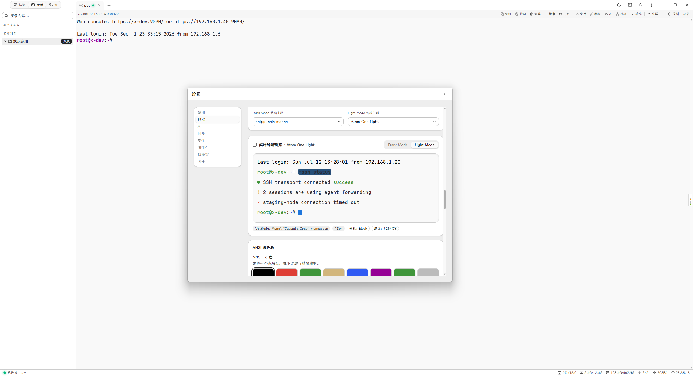
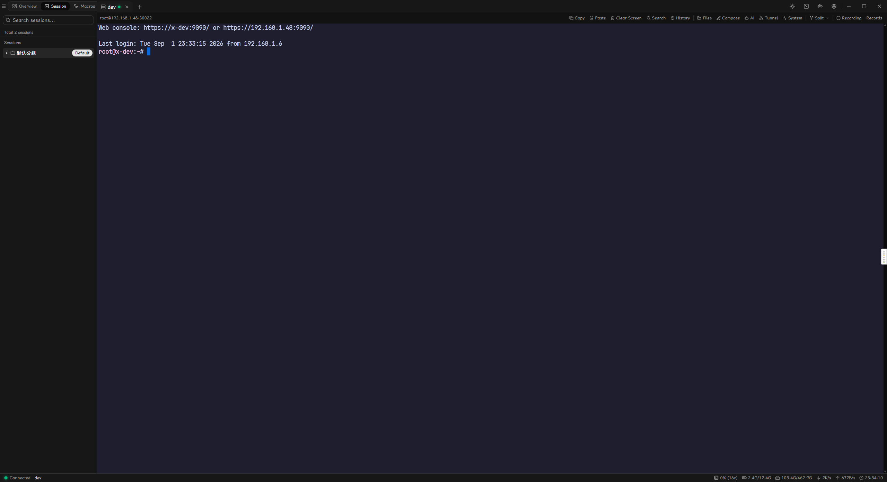

# MSSH — Secure Shell Client & Session Manager

[](https://github.com/xuthus5/mssh/actions/workflows/ci.yml)
[](https://github.com/xuthus5/mssh/actions/workflows/release.yml)
[](LICENSE)

A cross-platform SSH workstation for people who manage many hosts, many terminals, and many repeatable operations. MSSH combines session management, terminal workflows, file transfer, automation, recording, and AI-assisted tasks in one desktop app built with Go + Wails v3 + React.

> [中文](README_zh-CN.md)

---

## Show


****

## Product overview

MSSH is designed around a simple idea: a connection is more than a shell. A useful SSH client must also manage sessions, keep related assets close to the terminal, preserve context across reconnects, and make repetitive work safer.

It covers the full loop:

1. organize hosts, folders, tags, environments, projects, tunnels, keys, and macros
2. open SSH, local shell, or serial terminals
3. split, search, duplicate, reconnect, and record terminal work
4. move files with SFTP and track transfer progress
5. automate routine actions with macros and batch operations
6. use native AI tasks or a local CLI bridge when you want an agent to operate on a remote session

### Intended use

MSSH fits desktop workflows where operators need a reliable local control plane for remote machines:

- developers who switch between project hosts, local shells, tunnels, and file transfer
- SRE / operations users who need searchable sessions, macros, audit records, and reconnect behavior
- teams that prefer local encrypted storage and explicit approval before automated or AI-assisted mutation

MSSH is not a fleet orchestrator. It focuses on saved SSH sessions and terminal-centered operations, with each task bound to a specific session and its own connection lifecycle.

The desktop app has an authenticated unified local IPC transport available for rollout testing. The default build keeps Wails' compatibility transport until cross-platform soak testing completes; interactive xterm input is batched to avoid one RPC per character.

---

## What you get

### Terminal workspace

- Persistent top-level terminal tabs with right-click rename of the temporary title
- Recursive split panes with independent reconnect support
- Close and close-all from the terminal tab context menu, with optional confirmation
- Command history prediction ranked by most recent execution; Shift+Tab accepts, plain Tab stays with the shell
- Active search inside terminal output with text or regex mode
- Playback for recorded sessions
- Local shell terminals for machine-local workflows

### Session and asset management

- Central session catalog with folders, environments, projects, and tags
- Session search, quick connect, and asset detail panels
- Session context menu: connect, edit, duplicate, quick rename, copy credentials, delete
- Import/export for MSSH, PuTTY, SecureCRT, and MobaXterm CSV formats
- Batch update, delete, and macro execution across selected sessions

### File transfer

- SFTP file browser with list/tree views, multi-select uploads, and a right-click menu for download, rename, delete, new file, and new folder
- Hidden-file filtering and native file dialogs; dismissed pickers are a no-op, not an error
- OSC 7 directory following, with optional Bash/Zsh startup-script integration
- Transfer center with progress, ETA, retry, history, and cancellation; the open directory reloads as soon as an upload into it completes

### Automation

- Macros for repeatable command sequences
- SSH key generation and key management
- Port forwarding for local, remote, and dynamic tunnels
- Session recording and playback

### Cloud sync and backup

- Encrypted `.msshbackup` export and import
- GitHub Gist, WebDAV, and AWS S3 sync providers
- S3-compatible path-style access for MinIO and Ceph deployments
- Local version history and sync operation records

### AI tasks

- Native agent tasks driven by configured OpenAI-compatible providers
- Local CLI tasks through the MSSH MCP bridge for Claude Code, OpenCode, or Codex (Codex requires an explicit weak-isolation opt-in)
- Step-level mutation approval and hard-blocked destructive commands
- Persistent task state with manual resume after restart

### Serial and desktop integration

- Serial terminal support for baud rates from 300 to 4,000,000
- Data bits, parity, and stop bits, plus manual DTR/RTS signals; hardware and software flow control are rejected with an explicit error until a public driver API can express them
- DTR, RTS, Break, local echo, and exclusive device lock controls
- System tray, configurable close-button behavior, and daily local logs

### Appearance and shortcuts

- Offline terminal themes, including GitHub, Dracula, Nord, TokyoNight, and Catppuccin variants
- `.itermcolors` import
- Dark, light, and fixed theme assignments
- Customizable keyboard shortcuts with conflict detection

### Security and operational controls

- Master-key encryption for sensitive local data
- Host key verification with change detection: block, warn, or trust new fingerprints
- One SSH dialog for connection progress, fingerprint approval, and success, with automatic terminal focus
- Optional per-session SSH jump hosts with connection tests and progress, for hosts on private networks
- Manage trusted host fingerprints from the Overview
- System keychain integration on Linux, Windows, and macOS
- Optional audit logging for connections, sync, key access, and batch operations

---

## Demo workflow

```text
1. Add a session.
2. Connect and open a terminal tab.
3. Split the tab for a second host or pane.
4. Transfer files with SFTP or run a macro.
5. Enable auto-reconnect or resume tasks when a connection drops.
```

---

## Platform support

| Platform | Packages |
| --- | --- |
| Linux | binary, deb, rpm, AppImage, Flatpak |
| Windows | exe + NSIS installer |
| macOS | universal `.app` zip |

Release artifacts include SHA-256 checksums, CycloneDX SBOM, provenance attestations, and Sigstore signatures.

---

## Getting started

### Install

Download an artifact from [Releases](https://github.com/xuthus5/mssh/releases), or use the package manager / distribution format that fits your environment.

```bash
# Linux Flatpak
flatpak install flathub io.github.xuthus5.mssh

# Linux AppImage
chmod +x mssh-*.AppImage
./mssh-*.AppImage

# macOS
unzip mssh-macos-*.zip
open mssh.app

# Windows
mssh-setup-*.exe
```

### Run from source

```bash
# Install frontend dependencies
cd frontend && npm ci && cd ..

# Start the desktop app in development mode
wails3 task dev
```

### First connection

1. Create or import a session.
2. Open the session from the sidebar or the session catalog.
3. Use the terminal, file panel, tunnel panel, or macro actions from the same workspace.

---

## Development

### Prerequisites

- Go 1.27+ (`.go-version` pins the exact patch version)
- Node.js 24+ (`.node-version` pins the exact version)
- [Wails v3 CLI](https://github.com/wailsapp/wails) at the version in `.wails-version`: `go install github.com/wailsapp/wails/v3/cmd/wails3@$(tr -d '\r\n' < .wails-version)`
- Linux only: GTK4 and WebKitGTK 6.0 development packages

### Quality gate

```bash
wails3 task ci
```

The gate first verifies that your Go, Node.js, and Wails versions match those three
files exactly; a newer major/minor toolchain still fails that check by design.
It then runs:

1. `golangci-lint run --timeout 5m ./...` (latest release, built with the pinned Go)
2. `go test -race -coverprofile=coverage.out -covermode=atomic -coverpkg=./internal/...,./pkg/... ./internal/... ./pkg/...`
3. `npm run check:source-limits`, `npm run check:bundle-budget`, `npm test`
4. `wails3 task build`

The backend test stage is Linux-oriented: CI runs it on `ubuntu-latest`, and several
suites assert POSIX paths and file modes. On Windows, `wails3 task test:windows`
(plus `wails3 task lint` and `go vet ./...`) covers what is expected to pass there.

### Useful tasks

```bash
wails3 task lint
wails3 task fmt
wails3 task test
wails3 task test:frontend
wails3 task test:e2e
wails3 task benchmark
wails3 task package
```

### Diagnostics

Run with `MSSH_LOG_LEVEL=debug` to write detailed logs (including terminal I/O timings and byte previews) to `~/.mssh/logs/`; frontend terminal traces are forwarded to the same file automatically.

Terminal output aggregation (reduces high-frequency events) can be tuned with environment variables:

| Variable | Default | Description |
| --- | --- | --- |
| `MSSH_TERMINAL_BATCH_DISABLE` | unset | Set to `1` to disable aggregation |
| `MSSH_TERMINAL_BATCH_IDLE_MS` | `10` | Idle flush window (ms) |
| `MSSH_TERMINAL_BATCH_SIZE` | `16384` | Flush once buffered bytes reach this |
| `MSSH_TERMINAL_BATCH_MAX` | `65536` | Maximum buffered bytes |
| `MSSH_WEBVIEW_GPU` | unset | Override the WebView hardware-acceleration policy (`always`/`never`); defaults to Settings → Terminal → Rendering → Hardware acceleration, applied on restart, off by default for dialog stability |

---

## Packaging

Tagged releases (`v*`) trigger the release pipeline and produce platform-specific installers and archives.

| Platform | Output |
| --- | --- |
| Linux | binary, deb, rpm, AppImage, Flatpak |
| Windows | exe + NSIS installer |
| macOS | universal `.app` zip |

For packaging details, see [docs/packaging.md](docs/packaging.md).

---

## Documentation

- [docs/packaging.md](docs/packaging.md)
- [docs/performance-budgets.md](docs/performance-budgets.md)
- [docs/frontend-performance-notes.md](docs/frontend-performance-notes.md)
- [docs/design/](docs/design)
- [docs/ears-backend-review.md](docs/ears-backend-review.md)
- [docs/ears-frontend-review.md](docs/ears-frontend-review.md)

---

## Tech stack

| Layer | Technology |
| --- | --- |
| Frontend | React 19, TypeScript 7, Vite 8, Tailwind CSS 4, xterm.js 6 |
| Backend | Go 1.27, Wails v3 (GTK4 + WebKitGTK 6.0) |
| Database | SQLite (modernc.org/sqlite) |
| SSH | golang.org/x/crypto, pkg/sftp |
| Crypto | Argon2id, AES-256-GCM |
| Keychain | go-keyring |
| Serial | go.bug.st/serial |
| Cloud SDK | AWS SDK v2 |

---

## Contributing

Before committing or pushing, run the local gate:

```bash
wails3 task ci
```

See the repository guidelines in `AGENTS.md` for coding, testing, and delivery rules.

---

## License

[MIT](LICENSE)
